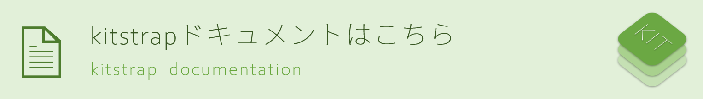

# kitstrap

<p>&nbsp;</p>


<p>&nbsp;</p>

<p align="center">
  <a aria-label="GitHub tag" href="https://github.com/mtsgi/kitstrap/releases">
    
  </a>
  <a aria-label="License" href="https://github.com/mtsgi/kitstrap/blob/master/LICENSE">
    
  </a>
</p>

<p align="center">
  <a aria-label="NPM version" href="https://www.npmjs.com/package/kitstrap">
    
  </a>
  <a aria-label="NPM bundle size" href="https://www.npmjs.com/package/kitstrap">
    
  </a>
  <a aria-label="NPM downloads" href="https://www.npmjs.com/package/kitstrap">
    
  </a>
</p>

<p align="center">
  <a aria-label="Netlify Status" href="https://app.netlify.com/sites/kitstrap/deploys">
    
  </a>
</p>

<p>&nbsp;</p>

<p align="center">
  kitstrapは軽量のCSSフレームワークです。
</p>

<p>&nbsp;</p>

<table frame=void>
  <tbody>
    <tr>
      <td>
      <h3>📐 Design Language</h3>
      <p>kitstrapは、kitDesktopのデザイン言語に基づいています。</p></td>
      <td>
        <h3>💠 Modularized</h3>
        <p>kitstrapパッケージでは、フォントやカーソルの設定はモジュール化されています。</p>
      </td>
      <td>
        <h3>✨ Clean CSS</h3>
        <p>kitstrapは、<code>!important</code>規則を使用しません。</p>
      </td>
    </tr>
  </tbody>
</table>

<p>&nbsp;</p>

[](https://kitstrap.netlify.app/)

<p>&nbsp;</p>

<p align="center">
  <a href="https://www.npmjs.com/package/kitstrap"></a>
</p>

<p align="center">
  <a href="https://github.com/mtsgi/kitstrap">
    
    <strong>View on GitHub</strong>
   </a>
</p>

<p>&nbsp;</p>

## 📦 Usage

`kitstrap.css`を読み込むだけで、すぐに使い始めることができます。

```html
<link rel="stylesheet" href="https://cdn.jsdelivr.net/gh/mtsgi/kitstrap@1.0/d/kitstrap.css">
```

または、npmを利用することもできます。

```sh
npm i kitstrap
# or
yarn add kitstrap
```

[リリース一覧](https://github.com/mtsgi/kitstrap/releases)から、任意のバージョンをダウンロードして使用可能です。

```html
<link rel="stylesheet" href="./d/kitstrap.css">
```

導入方法の詳細は[こちら](https://mtsgi.github.io/kitstrap/docs/installation.html)をご覧ください。

## 🚚 Download

GitHubから最新のkitstrapをダウンロード可能です。

- [最新版zipのダウンロード](https://github.com/mtsgi/kitstrap/archive/master.zip)
- [最新版のkitstrap.css](https://mtsgi.github.io/kitstrap/d/kitstrap.css)

## 📖 Wiki

[kitstrap Wiki](https://github.com/mtsgi/kitstrap/wiki)
