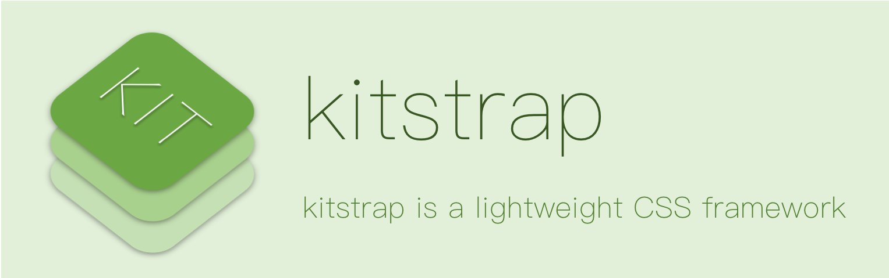

## kitstrap



## Usage
```
<link rel="stylesheet" href="./d/kitstrap.css">
```

kitstrap.cssを読み込めば、すぐに使うことができます。

## Sample

使用例や要素の見た目を確認できます。

- [kitstrapサンプル](https://mtsgi.github.io/kitstrap/sample.html)

## Documentation

Wikiで[kitstrapのドキュメント](https://github.com/mtsgi/kitstrap/wiki)を見ることができます。